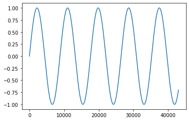
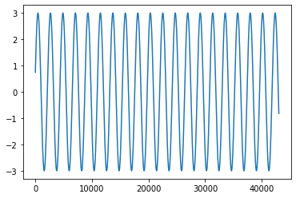
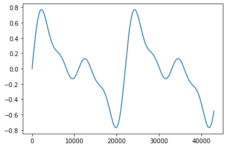
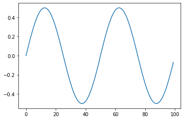

# hum
Generate synthetic signals for ML pipelines


To install:	```pip install hum```

# functionality
This notebook gathers various examples of the functionality of `hum`:
- Synthetic datasets
    - sound-like datasets
    - diagnosis datasets
    - signal generation
- Plotting and visualization
    - plot
    - display
    - melspectrograms
- Infinite waveform from spectrums
- Various sample sounds
- Voiced time


```python
from hum import (mk_sine_wf, 
                 freq_based_stationary_wf, 
                 BinarySound, 
                 WfGen, 
                 TimeSound, 
                 mk_some_buzz_wf, 
                 wf_with_timed_bleeps,
                 Sound,
                 plot_wf,
                 disp_wf,
                 InfiniteWaveform,
                 Voicer, 
                 tell_time_continuously,
                 random_samples,
                 pure_tone,
                 triangular_tone,
                 square_tone,
                 AnnotatedWaveform,
                 gen_words,
                 categorical_gen,
                 bernoulli_gen,
                 create_session,
                 session_to_df
                )
import matplotlib.pyplot as plt
from numpy.random import randint
import numpy as np
```

## Synthetic datasets
There are several different forms of synthetic data that `hum` can produce to be used in machine learning pipelines, with the first being sound-like datasets generally in the form of sine waves 

### Sound-like datasets

`mk_sine_wf` provides an easy way to generate a simple waveform for synthetic testing purposes


```python
DFLT_N_SAMPLES = 21 * 2048
DFLT_SR = 44100
wf = mk_sine_wf(freq=5, n_samples=DFLT_N_SAMPLES, sr=DFLT_SR, phase=0, gain=1)
plt.plot(wf);
```


    

    


```python
wf = mk_sine_wf(freq=20, n_samples=DFLT_N_SAMPLES, sr=DFLT_SR, phase = 0.25, gain = 3)
plt.plot(wf);
```


    

    


`freq_based_stationary_wf` provides the ability to generate a more complex waveform by mixing sine waves of different frequencies with potentially different weights


```python
wf_mix = freq_based_stationary_wf(freqs=(2, 4, 6, 8), weights=None,
                             n_samples = DFLT_N_SAMPLES, sr = DFLT_SR)
plt.plot(wf_mix);
```


    

    


```python
wf_mix = freq_based_stationary_wf(freqs=(2, 4, 6, 8), weights=(3,3,1,1),
                             n_samples = DFLT_N_SAMPLES, sr = DFLT_SR)
plt.plot(wf_mix);
```


    

    


`WfGen` is a class that allows for the generation of sinusoidal waveforms, the generation of lookup tables to be used in generating waveforms, and frequency weighted mixed waveforms


```python
wfgen = WfGen(sr=44100, buf_size_frm=2048, amplitude=0.5)
lookup = np.array(wfgen.mk_lookup_table(freq=880))
wf = wfgen.mk_sine_wf(n_frm=100, freq=880)
```


```python
np.array(lookup).T
```


    array([ 0.        ,  0.06252526,  0.12406892,  0.1836648 ,  0.24037727,
            0.293316  ,  0.34164989,  0.38462013,  0.42155213,  0.45186607,
            0.47508605,  0.49084754,  0.49890309,  0.49912624,  0.49151348,
            0.47618432,  0.45337943,  0.42345682,  0.38688626,  0.34424188,
            0.29619315,  0.24349441,  0.186973  ,  0.12751624,  0.06605758,
            0.00356187, -0.05898977, -0.12061531, -0.18034728, -0.23724793,
           -0.29042397, -0.33904057, -0.38233448, -0.41962604, -0.45032977,
           -0.47396367, -0.4901567 , -0.49865463, -0.49932406, -0.49215447,
           -0.47725843, -0.45486979, -0.42534003, -0.38913276, -0.34681639,
           -0.29905527, -0.2465992 , -0.19027171, -0.13095709, -0.06958655])


```python
plt.plot(wf);
```


    

    


```python
wf_weight = wfgen.mk_wf_from_freq_weight_array(n_frm=10000, freq_weight_array=(10,1,6))
plt.plot(wf_weight);
```


    

    

